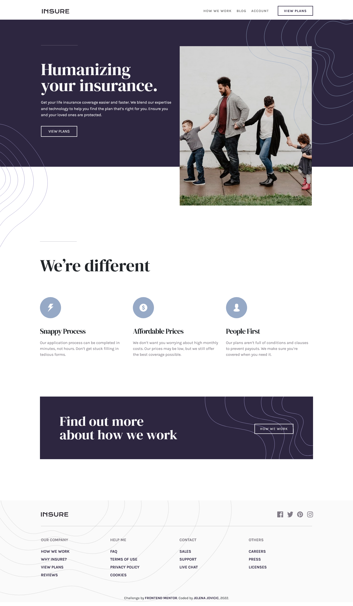

# Frontend Mentor - Insure landing page solution

This is a solution to the [Insure landing page challenge on Frontend Mentor](https://www.frontendmentor.io/challenges/insure-landing-page-uTU68JV8). Frontend Mentor challenges help you improve your coding skills by building realistic projects. 

## Table of contents

- [Overview](#overview)
  - [Description](#description)
  - [Screenshot](#screenshot)
  - [Links](#links)
- [My process](#my-process)
  - [Built with](#built-with)
  - [Observations](#observations)
  - [Useful resources](#useful-resources)
- [Author](#author)
- [Acknowledgments](#acknowledgments)

## Overview

### Description

A landing page for an insurance company, an exercise in customizing Bootstrap with Sass, while maintaining perfect Lighthouse score.

### Screenshot

  

### Links

- [Solution](...)
- [Live](https://je-jo.github.io/insure-landing-page/)

## My process

### Built with

- Semantic HTML5 markup
- Mobile-first workflow
- Bootstrap 5
- Sass

### Observations

This was a great learning experience. I learned a lot about importing modules and modifying Bootstrap maps. Eventually, I settled for overriding default variables and writting custom styles, because it made more sense with the scope of this project.

### Useful resources

- [google web fonts helper]()
- [squoosh]()
- [CSS filter generator to convert from black to target hex color](https://codepen.io/sosuke/pen/Pjoqqp) - To change the hover color of svg icons to the exact shade, when svg images are referenced with img tags.
- [PerfectPixel](https://www.welldonecode.com/perfectpixel/) a Chrome extension for comparing website with design image.

## Author

- [Github](https://github.com/je-jo)
- [Frontend Mentor](https://www.frontendmentor.io/profile/je-jo)
- [Codepen](https://codepen.io/je-jo)
- [Twitter](https://twitter.com/jelena_jo_)